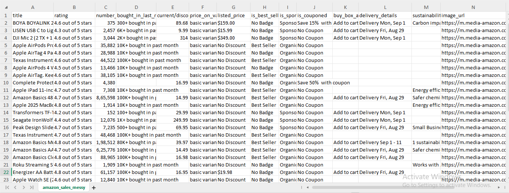
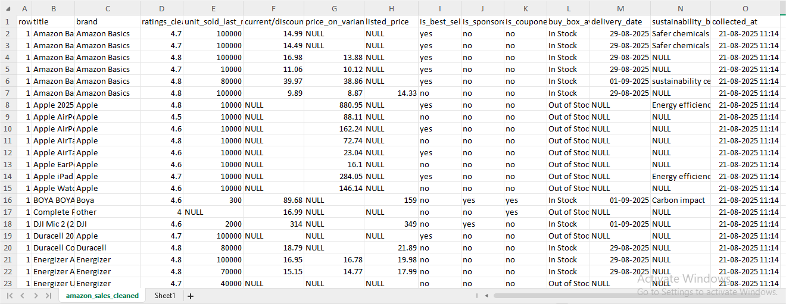
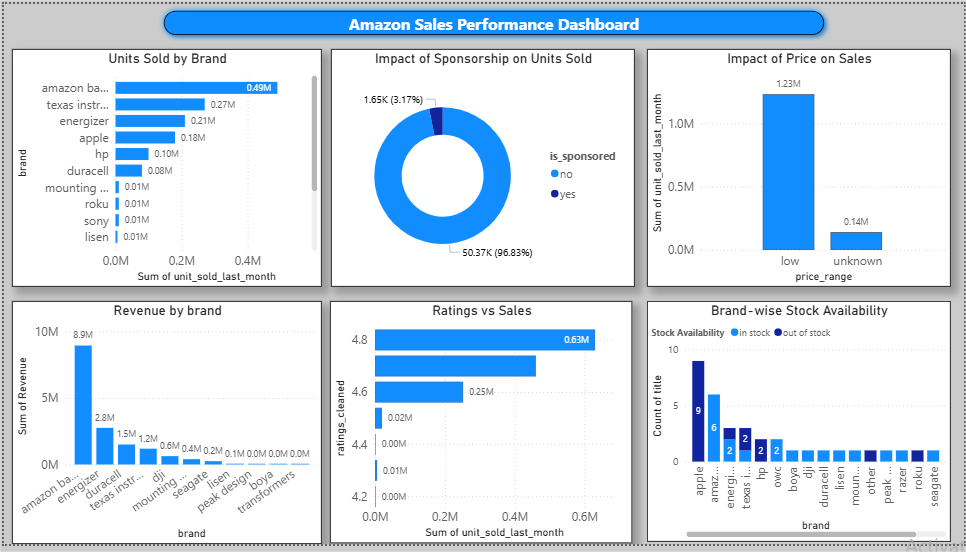
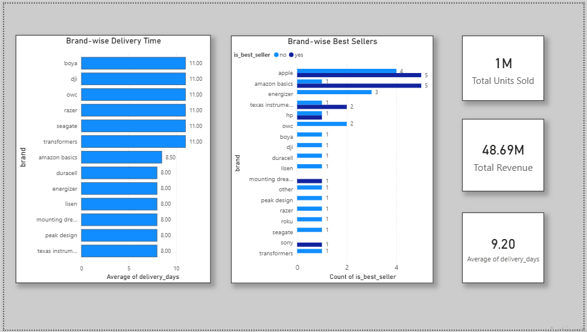

# 📊 Amazon Sales Data Analysis (SQL + Power BI)

This project demonstrates an end-to-end data analytics workflow using **SQL** for data cleaning and exploratory analysis, and **Power BI** for dashboard creation.  
The dataset includes Amazon product details such as ratings, pricing, stock availability, units sold indicators, and seller attributes.

---

# 1️⃣ **Dataset**

The project uses a small raw dataset containing Amazon product listings with fields such as:

- Product title  
- Ratings  
- Number of reviews  
- Units sold (e.g., “5K+”, “200+”)  
- Current price / listed price  
- Best seller 
- Sponsored / coupon status  
- Stock availability  
- Delivery date  
- Product URL  
- Sustainability badges 

---

# 2️⃣ **Data Cleaning (SQL)**

The raw data contained inconsistencies, duplicates, missing values, and unstructured text.  
All cleaning was performed using **MySQL**.

### ✔ Key Cleaning Steps

#### **1. Duplicate Removal**
Identified duplicates using `ROW_NUMBER()` window function and removed extra records.

#### **2. Ratings Cleaning**
Converted values like `"4.5 out of 5"` → numeric `4.5`.

#### **3. Reviews Standardization**
Removed commas and converted to integer.

#### **4. Units Sold Extraction**
Parsed formats like `"5K+"` or `"200+"` to extract numeric units sold.

#### **5. Price Cleaning**
Handled missing values and converted:
- discounted price  
- price on variant  
- listed price  
into `DECIMAL` format.

#### **6. Category Normalization**
Standardized:
- `is_best_seller` → yes/no  
- `is_sponsored` → yes/no  
- `is_couponed` → yes/no  

#### **7. Delivery Date Cleaning**
Transformed messy text into SQL `DATE` format using string functions and `STR_TO_DATE()`.

#### **8. Brand Extraction**
Created a new `brand` column using pattern matching from the product title.

#### **9. Final Cleaned Table**
Exported a structured dataset used for EDA and visualization.

### 📸 Raw Dataset


### 📸 Cleaned Dataset


---

# 3️⃣ **Exploratory Data Analysis (SQL)**

EDA was performed to answer key business questions.

### ✔ Questions Explored

####  **1. Which products/brands have highest ratings?**
Used `MAX()` and filtering.

####  **1. Revenue estimation**
`Revenue = units_sold * price`  
Used `COALESCE()` to handle multiple price fields.

####  **3. Sponsored vs Non-Sponsored performance**
Analyzed:
- average units sold  
- count of sponsored products  
- best seller distribution  

####  **4. Stock availability**
Compared in-stock vs out-of-stock counts by brand.

####  **5. Delivery speed**
Calculated average delivery days:
```
DATEDIFF(delivery_date, collected_at)
```

####  **6. Ratings vs Sales**
Grouped by rating to observe selling patterns.

####  **7. Price Range Analysis**
Classified products into:
- low price  
- medium  
- high price  

and compared sales volume.

---

# 4️⃣ **Power BI Dashboard**

A Power BI dashboard was built to visualize:

- 🔹 Sales distribution  
- 🔹 Ratings overview  
- 🔹 Revenue contribution  
- 🔹 Stock availability  
- 🔹 Price vs units sold  
- 🔹 Delivery performance  

### 📸 Dashboard Preview
  



---

# 5️⃣ **Key Insights**

-  **Amazon Basics** and **Apple** products appear frequently  
-  Products with moderate prices tend to have better unit sales  
-  Sponsored listings do not always guarantee higher sales  
-  Some brands have higher out-of-stock occurrences  
-  Delivery time varies significantly across brands  
-  Ratings show a weak correlation with units sold  

---

# 6️⃣ **Tools Used**

- **MySQL** – data cleaning, preprocessing, EDA  
- **Power BI Desktop** – dashboard development  
- **CSV/Excel** – raw & cleaned dataset storage  
  

---


